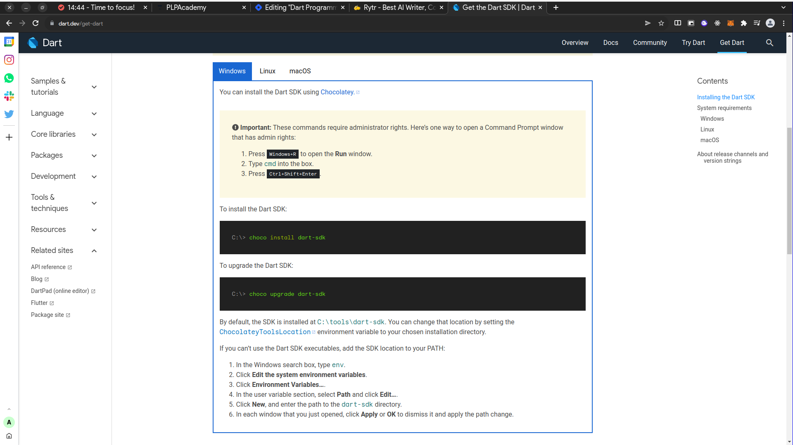

# Dev_Setup
Setup Development Environment

#Assignment: Setting Up Your Developer Environment

#Objective:
This assignment aims to familiarize you with the tools and configurations necessary to set up an efficient developer environment for software engineering projects. Completing this assignment will give you the skills required to set up a robust and productive workspace conducive to coding, debugging, version control, and collaboration.

#Tasks:

<!-- 1. Select Your Operating System (OS):
   Choose an operating system that best suits your preferences and project requirements. Download and Install Windows 11. https://www.microsoft.com/software-download/windows11-->

   <!-- Solution (procedure)-->

   Before I got started,I made sure to have:

An internet connection and A blank USB drive with at least 8GB of storage to create a bootable USB with the media creation tool. A blank USB is recommendade because any content on it will be deleted during the creation process.

I Plugged the USB drive into your Windows device to make it available to create a bootable USB with the media creation tool when needed.

Create Windows 11 Installation Media by following the below steps.

Download Windows 11 media creation tool
After the download is completed, open the media creation tool file to run it. You need to be an administrator to run this tool.

If you agree to the license terms, select Accept.

Uncheck the Use the recommended options for this PC box to select the appropriate language and edition.

Select the bootable USB flash drive with at least 8GB of space that you have prepared to use, then select Next. Reminder: any content on the USB flash drive will be deleted.

The USB device will be formatted, and the Windows installation media will be placed on the USB flash drive.

The USB flash drive will now serve as bootable Windows 11 Installation Media. Select Finish.

For more details, visit the Download Windows 11 page and scroll down to the Create Windows 11 Installation Media section.

Please back up all content you want to keep from the Windows device you will clean install, as all content on it will be deleted during the process. The content may include photos, documents, application files, etc.

You may now clean install Windows 11 on your device from the installation media you created on the USB flash drive:

Attach the USB flash drive to the PC on which you want to clean install Windows 11.

Restart your PC while holding the Shift key to boot into the Windows Recovery Environment (WinRE). Once in the Windows Recovery Environment, choose to boot from the USB drive.

On the Windows Setup page, select your language, time and keyboard preferences and then select Next.

Select Install now.

On the Activate Windows page, select I don’t have a product key if you are reinstalling the same edition of Windows. Your copy of Windows will be automatically activated later after reconnecting your Microsoft Account. Select Next.

On Select the operating system you want to install page, choose the same edition of Windows 11 as verified on the PC in step 2 above, then select Next. g. If you agree to the Microsoft Software License Terms, select Accept. Then select Next.

If you agree to the Microsoft Software License Terms, select Accept. Then select Next.

Select Custom: Install Windows only (advanced) as the install type. Make sure you’ve backed up all content on your PC before proceeding.

Choose the hard drive on your PC where you want to install Windows, select Next. Windows installation will begin. Don’t turn off your PC.

<!-- QUESTION 2-->
<!--2. Install a Text Editor or Integrated Development Environment (IDE):
   Select and install a text editor or IDE suitable for your programming languages and workflow. Download and Install Visual Studio Code. https://code.visualstudio.com/Download -->

   <!--SOLUTION -->
Download the Visual Studio Code installer for Windows.
Once it is downloaded, run the installer (VSCodeUserSetup-{version}.exe). This will only take a minute.

<!--3. Set Up Version Control System:
   Install Git and configure it on your local machine. Create a GitHub account for hosting your repositories. Initialize a Git repository for your project and make your first commit. https://github.com-->

1. Download and Install Git
Visit the official Git downloads page: https://www.git-scm.com/downloads
Download the installer for your operating system
Run the downloaded installer and follow the on-screen instructions.
Windows: During installation, ensure you check the option to "Use Git from the Windows Command Prompt".

2. Verifying Git Installation
Open a terminal window (Command Prompt on Windows, Terminal on macOS/Linux).
Type git --version and press Enter.
If Git is installed correctly, you should see the installed Git version number displayed.
3. Creating a GitHub Account
Visit GitHub: 
Click on "Sign up" and create a new account.
Verify your email address by following the instructions sent by GitHub.
4. Initializing a Git Repository for Your Project
Open a terminal window and navigate to your project directory using the cd command.
Run the command git init to initialize a new Git repository in your current directory. This creates a hidden .git folder that stores version control information.
5. Making Your First Commit
Create some files for your project (e.g., Python scripts, text files).
Stage the changes you want to commit using the git add command. You can add specific files or use git add . to add all modified files in the current directory.
Run the command git commit -m "Initial commit". This creates a snapshot of the current project state and adds a descriptive message describing the changes.
Note: Replace "Initial commit" with a more specific message relevant to your project changes.

6. Verifying Your Local Git Repository
You can use the following commands to verify your local Git repository:
git status: This shows the current status of your working directory and the staging area.
git log: This displays the commit history of your repository.99i

Below is an a repository i ceated:  "https://github.com/Paul-Mulatya-hub/Myweb1.git"

<!--4. Install Necessary Programming Languages and Runtimes:
  Instal Python from http://wwww.python.org programming language required for your project and install their respective compilers, interpreters, or runtimes. Ensure you have the necessary tools to build and execute your code.-->

  <!--SOLUTION-->

Visit the official Python downloads page: https://www.python.org/downloads/.
Select the latest version of Python. Make sure to download the installer for your system (32-bit or 64-bit).

Double-click the downloaded installer file (e.g., python-3.11.x-amd64.exe).

In the installer window,  check the box "Add Python 3. to PATH" . This ensures you can run Python from any command prompt.

 You can check other options like "Install launcher for all users" if you want everyone on the computer to be able to access Python.

Click "Install Now" and follow the on-screen instructions.

To Verify Installation :
Open a command prompt window (search for "cmd" in the Start menu).

Type python --version and press Enter.

If Python is installed correctly, you should see the installed Python version number displayed.

<!--5. Install Package Managers:
   If applicable, install package managers like pip (Python).-->
The following code will install the latest version of the package.
pip install package_name

Specifying Package Version:
pip install package_name==1.2.3

Installing from Requirements File:
pip install -r requirements.txt

Upgrading a Package:
pip install --upgrade package_name

Installing from a Git Repository:
pip install git+https://github.com/user/repo.git

Installing from a Specific Branch:
pip install git+https://github.com/user/repo.git@branch_name

Installing from a ZIP File:
pip install https://example.com/package.zip

Installing from a Local Directory:
pip install /path/to/local/directory  

Installing Development Version:
pip install -e git+https://github.com/user/repo.git#egg=package_name

<!--6. Configure a Database (MySQL):
   Download and install MySQL database. https://dev.mysql.com/downloads/windows/installer/5.7.html-->

   The first step in the installation process is to download the installer from dart.dev
Installing Dart SDK on Windows will be:

Verify the installation was successful

To verify the installation was completed successfully, run the following command in your terminal.

dart --version

<!--8. Explore Extensions and Plugins:
   Explore available extensions, plugins, and add-ons for your chosen text editor or IDE to enhance functionality, such as syntax highlighting, linting, code formatting, and version control integration.-->

   VS Code extends its functionality through a vast library of extensions, offering a ton of options to customize your development experience. Let's explore some extensions for the functionalities you mentioned:

Syntax Highlighting:

Better Comments for improved comment styling.
One Dark Pro for a popular dark theme with excellent syntax highlighting.
Language-specific options: Many extensions provide syntax highlighting for specific languages like Python (Pylance) or Java (Java Extension Pack).
Linting:

General-purpose linters:
ESLint for JavaScript and TypeScript with various linting rules.
Stylelint for enforcing consistent CSS style.
Language-specific linters: Many languages have dedicated linters, like Pylint (Python) or cppcheck (C/C++).
Code Formatting:

General-purpose formatters:
Prettier for automatic code formatting across various languages.
Beautify for code beautification and formatting.
Language-specific formatters: Some extensions offer formatting specifically for a language, like autopep8 (Python).

Version Control Integration:

Built-in support: VS Code already offers built-in Git integration for version control functionalities.
Enhanced Git experience:
GitLens for advanced Git features like code authorship visualization.

<!--9. Document Your Setup:
    Create a comprehensive document outlining the steps you've taken to set up your developer environment. Include any configurations, customizations, or troubleshooting steps encountered during the process. 

    

#Deliverables:
- Document detailing the setup process with step-by-step instructions and screenshots where necessary.
- A GitHub repository containing a sample project initialized with Git and any necessary configuration files (e.g., .gitignore).
- A reflection on the challenges faced during setup and strategies employed to overcome them.

#Submission:
Submit your document and GitHub repository link through the designated platform or email to the instructor by the specified deadline.

#Evaluation Criteria:**
- Completeness and accuracy of setup documentation.
- Effectiveness of version control implementation.
- Appropriateness of tools selected for the project requirements.
- Clarity of reflection on challenges and solutions encountered.
- Adherence to submission guidelines and deadlines.

Note: Feel free to reach out for clarification or assistance with any aspect of the assignment.-->
